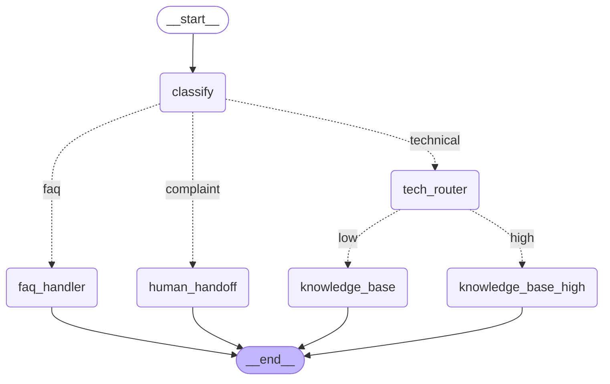

### Graph Flow

```mermaid
graph TD;
	__start__([__start__]):::first
	classify(classify)
	faq_handler(faq_handler)
	knowledge_base(knowledge_base)
	knowledge_base_high(knowledge_base_high)
	human_handoff(human_handoff)
	tech_router(tech_router)
	__end__([__end__]):::last
	__start__ --> classify;
	classify -.  faq  .-> faq_handler;
	classify -.  complaint  .-> human_handoff;
	classify -.  technical  .-> tech_router;
	tech_router -.  low  .-> knowledge_base;
	tech_router -.  high  .-> knowledge_base_high;
	faq_handler --> __end__;
	human_handoff --> __end__;
	knowledge_base --> __end__;
	knowledge_base_high --> __end__;
	classDef default fill:#f2f0ff,line-height:1.2
	classDef first fill-opacity:0
	classDef last fill:#bfb6fc
```