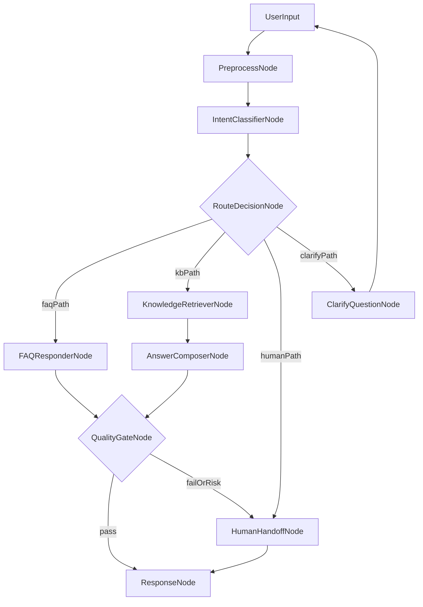

# LangGraph 智能客服路由系统（无代码实现蓝图）

## 1. 目标与范围

本蓝图用于指导你自行实现一个四路径智能客服路由系统，覆盖：
- 意图识别（Intent Recognition）
- FAQ 自动回复（FAQ Auto Reply）
- 知识库查询（Knowledge Base Retrieval）
- 人工转接（Human Handoff）

设计目标：
- 先稳定路由，再提升回答质量；
- 高风险场景优先安全（转人工）；
- 所有路由决策可解释、可追踪、可回放。

---

## 2. 四个核心能力到底是什么

### 2.1 意图识别（Intent Recognition）

含义：判断用户本轮对话“想解决什么问题”，并给出可信度与风险级别。

它不是关键词匹配，而是一个“语义分类 + 风险评估”过程。  
你应至少输出这四个字段：
- `intent`：用户意图标签；
- `confidence`：识别置信度，范围建议 `0.0~1.0`；
- `riskLevel`：风险等级，建议 `low/medium/high`；
- `needHumanNow`：是否应立刻转人工，布尔值。

建议意图标签（最小可用集合）：
- `faq_consult`：标准咨询（价格、流程、时效、规则）；
- `kb_problem`：需要查文档的复杂问题（功能配置、故障排查）；
- `transaction_request`：涉及订单、退款、改签、取消等交易动作；
- `complaint_or_escalation`：投诉、情绪升级、威胁曝光；
- `human_request`：明确要求人工。

### 2.2 FAQ 自动回复（FAQ Auto Reply）

含义：命中“标准问题 + 标准答案”的知识对，直接返回预置答案。

适用条件：
- 用户问题属于高频、低风险、答案稳定的问题；
- FAQ 相似度或匹配分足够高；
- 当前风险等级非高风险。

不适用场景：
- 问题涉及强上下文（例如历史工单状态）；
- 问题有明显时效性或强政策依赖；
- 需要个性化判断（如争议处理）。

### 2.3 知识库查询（Knowledge Base Retrieval）

含义：FAQ 未命中，但可在文档、手册、SOP、政策库中检索到依据时，走检索增强回答路径。

本质是“先找证据，再回答”。  
你的实现应约束：
- 回答尽量基于检索结果，不凭空编造；
- 保留检索依据（文档 ID、标题或片段）；
- 若依据不足，应触发澄清或转人工。

### 2.4 人工转接（Human Handoff）

含义：将会话与上下文交给真人坐席处理。

必须优先转人工的常见触发：
- 法律、合规、资金安全等高风险问题；
- 用户明确要求人工；
- 连续两轮自动流程未解决；
- 情绪明显升级（辱骂、投诉升级、威胁公开曝光）；
- 系统缺关键字段且澄清失败。

---

## 3. LangGraph 架构设计（节点 + 边）

### 3.1 推荐节点清单

- `PreprocessNode`：文本清洗、语言识别、上下文压缩；
- `IntentClassifierNode`：输出意图、置信度、风险；
- `RouteDecisionNode`：根据规则决定走 FAQ / KB / Human / Clarify；
- `FAQResponderNode`：FAQ 检索与标准答案返回；
- `KnowledgeRetrieverNode`：文档检索；
- `AnswerComposerNode`：基于检索证据生成答复；
- `QualityGateNode`：质量与风险闸门（是否放行）；
- `ClarifyQuestionNode`：信息不足时追问；
- `HumanHandoffNode`：封装并输出人工接管上下文；
- `ResponseNode`：统一对用户输出。

### 3.2 路由图（Mermaid）



---

## 4. 状态设计（State Schema）

你实现时建议维护以下状态层：

### 4.1 会话层
- `sessionId`
- `conversationHistory`
- `userProfile`（可选）
- `locale`

### 4.2 识别层
- `intent`
- `confidence`
- `riskLevel`
- `needHumanNow`
- `entities`（如订单号、产品型号、地区、时间）

### 4.3 路由层
- `route`（`faq` / `kb` / `human` / `clarify`）
- `routeReason`（文本，说明为何如此决策）
- `clarifyCount`

### 4.4 执行层
- `faqHit`（布尔）
- `faqId`（命中的 FAQ 条目）
- `retrievedDocs`（文档列表）
- `draftAnswer`
- `finalAnswer`

### 4.5 控制层
- `fallbackCount`
- `handoffFlag`
- `handoffReason`
- `trace`（每个节点的输入摘要与输出摘要）

---

## 5. 路由规则与阈值（先规则，后模型）

为保证稳定性，建议采用“硬规则 > 阈值规则 > 模型判断”的优先级。

### 5.1 硬规则（最高优先）

命中即转人工：
- `needHumanNow == true`
- `riskLevel == high`
- 用户显式要求人工（如“转人工”“找客服”）
- 投诉升级、法律风险、资金安全等红线场景

### 5.2 FAQ 路由条件（建议）

满足以下条件进入 FAQ：
- `intent == faq_consult`
- `confidence >= 0.78`
- FAQ 匹配分 `>= 0.82`
- `riskLevel == low`

否则进入 KB 或澄清流程。

### 5.3 知识库路由条件（建议）

满足以下条件进入 KB：
- FAQ 未命中或 FAQ 分数低于阈值；
- `confidence >= 0.60`；
- 问题属于可文档化范畴（功能、政策、操作步骤）；
- 检索结果至少有 1-2 条可信证据。

### 5.4 澄清路径条件（建议）

任一条件命中进入澄清：
- `confidence < 0.60`；
- 缺少关键实体（如订单号）；
- 用户意图冲突（同时出现退款 + 报障 + 投诉）；
- KB 检索证据不足。

澄清上限建议：
- `clarifyCount >= 2` 后仍不清晰，直接转人工。

### 5.5 失败兜底（避免循环）

- 自动路径累计失败 `fallbackCount >= 2` => 转人工；
- 质量闸门不通过（低可信、潜在幻觉、高风险）=> 转人工；
- 回答后用户继续表示“没解决”连续两次 => 转人工。

---

## 6. 质量闸门（Quality Gate）建议

放行回答前检查：
- 回答是否与当前意图一致；
- 是否包含足够依据（FAQ ID 或文档证据）；
- 是否触发敏感词/高风险策略；
- 是否漏掉用户必须字段。

闸门结论：
- `pass`：可直接回复；
- `failOrRisk`：转人工并附原因。

---

## 7. 人工转接上下文标准（给坐席的最小包）

人工接管时应至少带：
- 用户原始问题与最近 3~5 轮对话；
- 识别结果：`intent/confidence/riskLevel`；
- 已尝试路径：FAQ 是否命中、KB 检索摘要；
- 未解决原因：缺字段、证据不足、用户不满意；
- 推荐处理动作（例如“优先核验订单并执行退款流程”）。

这样可以减少用户重复描述，提高一次解决率。

---

## 8. 实现顺序（你可按此自建）

1. 打通主干：`IntentClassifierNode -> RouteDecisionNode -> HumanHandoffNode`；  
2. 接入 FAQ 路径，验证高频问题准确率；  
3. 接入 KB 路径，验证“有依据回答”；  
4. 加入 `ClarifyQuestionNode` 与 `QualityGateNode`；  
5. 完成人工转接上下文封装与观测埋点。

---

## 9. 测试样例集（四路径各至少 10 条）

### 9.1 意图识别测试维度
- 同义改写（“退款怎么走”/“我要退钱”）
- 多意图混杂（“退款失败而且我要投诉”）
- 口语噪声（错别字、简写、夹英文）
- 上下文依赖（“还是刚才那个订单”）

### 9.2 FAQ 路径样例（示例）
- “你们支持哪些支付方式？”
- “发票怎么开？”
- “会员权益有哪些？”

预期：FAQ 命中 + 低延迟回复。

### 9.3 KB 路径样例（示例）
- “企业版如何配置 SSO，失败了怎么排查？”
- “跨境订单税费规则在什么情况下变化？”
- “设备离线后重连策略是什么？”

预期：返回结构化步骤，并附检索依据。

### 9.4 人工转接样例（示例）
- “我要投诉你们欺诈，立刻转人工。”
- “账户被盗刷，马上人工处理。”
- “说了两次都没解决，给我人工。”

预期：立即转人工，不再自动闭环。

---

## 10. 验收指标（上线前最小闭环）

- 路由准确率（按四路径分别统计）
- FAQ 命中率与平均响应时长
- KB 回答有据率（回答包含有效依据的比例）
- 人工转接率（按意图类型分层）
- 一次解决率（First Contact Resolution）
- 转人工前自动尝试轮数（避免过度打扰）

建议先在离线测试集中调阈值，再灰度上线观察指标变化。


## 推荐项目结构（适合代码审查和长期维护）

建议按“**领域模块** + **流程编排**”拆分：

```text
your_project/
  app/
    main.py                      # 入口（API/CLI）
    config/
      settings.py                # 配置加载（env、阈值、开关）
      logging.py                 # 日志配置
    graph/
      builder.py                 # LangGraph 枢纽：建图、连边
      state.py                   # 统一 State 定义
      router.py                  # 路由决策函数（规则+阈值）
    nodes/
      preprocess.py
      intent_classifier.py
      faq_responder.py
      kb_retriever.py
      answer_composer.py
      web_search_retriever.py    # 可选：外部检索节点
      quality_gate.py
      clarify_question.py
      human_handoff.py
      responder.py
    services/
      llm_client.py              # 模型调用封装
      embeddings.py
      reranker.py
      faq_store.py               # FAQ 索引/匹配
      kb_store.py                # 向量库/文档库访问
      web_search.py              # 搜索与网页抓取封装
      policy_engine.py           # 风险规则/合规策略
    prompts/
      intent_prompt.txt
      answer_prompt.txt
      clarify_prompt.txt
    schemas/
      intent.py                  # Pydantic: intent输出结构
      route.py
      handoff.py
    observability/
      tracing.py                 # trace_id, span, route_reason
      metrics.py                 # 命中率/延迟/转人工率
    tests/
      unit/
      integration/
      eval/
        route_cases.yaml         # 四路径测试集
        golden_answers.yaml
```

---

## 每层职责（避免“巨石脚本”）

- `nodes/`：只做节点逻辑，保持“单一职责”
- `services/`：外部依赖与基础能力（LLM、向量库、Web 搜索）
- `graph/`：流程编排，不写业务细节
- `schemas/`：输入输出强类型，避免“字典乱飞”
- `prompts/`：Prompt 文件化，便于审查 diff
- `tests/eval/`：把路由样例和验收集独立出来，持续回归

---

## 代码审查友好的工程规则（强烈建议）

- 一个文件控制在单一模块，尽量不超过 200~300 行
- 每个节点只暴露一个 `run(state)` 或同类接口
- 路由阈值全部配置化（`settings.py`），禁止硬编码散落
- Prompt 改动与逻辑改动分开提交（便于 reviewer）
- 每次 PR 必带：新增/变更的测试样例（至少覆盖一条路径）
- 关键决策必须写 `routeReason` 到 trace，方便复盘误路由

---

## 给你一个落地顺序（1 周可完成的节奏）

- Day1-2：先搭 `graph/state/router` 骨架，只接人工路径
- Day3：接 FAQ 节点 + 路由阈值
- Day4：接 KB 检索与回答
- Day5：接 QualityGate + Clarify
- Day6：接 Web Search（可选）+ 白名单域名策略
- Day7：补评测集、指标与审查文档

---
